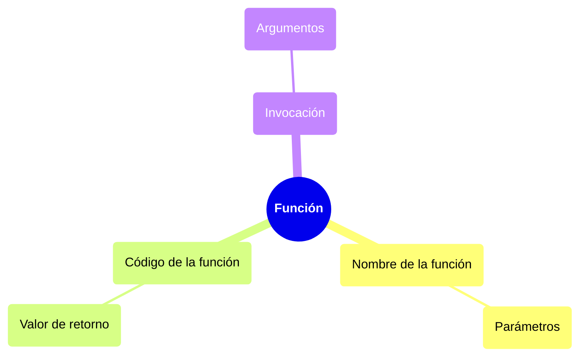

# Funciones

Una función es un bloque de código que se ejecuta cuando se llama, se pueden hacer llamadas a funciones multiples veces y en muchos puntos. Contiene un espacio al que le pueden pasar datos de entrada, conocidos como **parámetros**, y puede regresar datos de salida, resultado de las operaciones hechas dentro de la función.

Con la funciones se cumple **el principio DRY** (*Don't Repeat Yourself), que consiste en no repetir un bloque de código con la misma lógica una y otra vez, al tener funciónes que nos ahorrran el estar escribiendo las mismas instrucciones una y otra vez, tenemos un código más limpio y escalable.

> 📝 **Nota:** Previamente ya hemos trabajado con funciones, por ejemplo, la función `print(mensaje)` que imprime en la terminal lo que le pasemos como argumentos cuando la llamamos.

## Sintaxis

Se usa la palabra clave `def` seguida del nombre de la función y unos parentesís donde pueden ir o no argumentos de entrada para la función, y dos puntos `:`.

```python
def funcion(a, b):
    c = a + b
    print("La suma es", c)
```

Se usa la identación para definir el bloque de código que conforma a la función.

Una función puede dar datos de salida, usando la palabra calve `return`

```python
def funcion(a, b):
    c = a + b
    return c
```

### Partes de una función



## Llamar a una función

Para llamar a unsa función solo se debe poner el nombre de la función seguido de parentesís.

```python
def saluda():
    print("Saludos desde la función")

saluda()
```

> 📝 **Nota:** Si una función tiene parametros de entrada, estos se deben brindar al momento de hacer la llamada a función. "Se le deben pasar argumetos".

## Retornar un valor

Las funciones normalmente resuelven un problema o hacen una operación y después devuelven un valor. Para hacer que una función de un valor de salida se usa `return`.

```python
def saluda():
    return "Hola"
```

Se retorna un valor para que el programa lo use como más le convenga. Desde usarlos como parametros

## Parámetros por defecto

Por defecto, al llamar una función el número de argumentos debe coincidir con el número de parametros definidos al declarar la función.

```python
def find_volume(length, width, depth):
    return length * width * depth

result = find_volume(10, 20, 3)
```

Para que se asignen valores por defecto en caso de que falten algún argumento, se pueden indicar parámetros por defecto.

```python
def find_volume(length=1, width=1, depth=1):
    return length * width * depth

result = find_volume()
```

También se puede especificar si solo quiero cambiar uno o más valores por defecto.

```python
result = find_volume(width=10)
```

## Regresando múltiples valores

Para regresar múltiples valores, en el `return` se separa con comas los distintos valores que se desea regresar.

```python
def find_volume_doble(length = 1, width=1, depth=1):
    return length * width * depth, width, "Ejecucion exitosa"
```

Se va a regresar una tupla, de tal forma que, se puede capturar el resultado de dos formas:

- Todo junto, guardando la tupla como tal

```python
resultados = find_volume_doble(width=13)
print(resultados) # (13, 13, 'Ejecucion exitosa')
print(resultados[0])
```

- Elemento por elemento

```python
volumen, ancho, mensaje = find_volume_doble(width=9, length=2)
print(volumen)
print(ancho)
print(mensaje)
```
