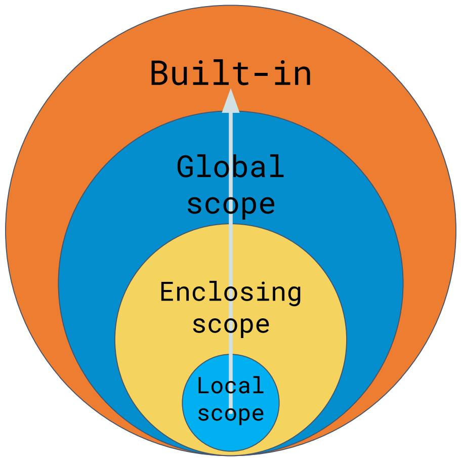

# El Scope

Traducido significa "el alcance". Se refiere a hasta dónde llega el alcance de las variables cuando las creamos o definimos funciones. Una variable solo esat disponible en dónde fue construida. En el siguiente diagrama se explica mejor la idea.



El *Local Scope* es el bloque donde definimos alguna variable, y podemos empezar a trabajar con ella. Conforme aumenta un proyecto se va teniendo un enfoque mayor. En el *Global Scope* tiene un alcance, por así decirtlo, de todo el archivo.

## Local Scope

Cuando una variable esta construida dentro de una función, solo puede usarse dentro de esa función, pertenece localmente a la función.

```python
def suma(a, b):
    c = a + b
    print(c)

suma(2,3)
```

En el ejemplo la variable `c` solo existe dentro de la función y no se puede acceder a ella fuera.

Si la función tiene otra función adentro, esta función de adetro tendra acceso a las variables locales de la primera.

```python
def myfunc():
  x = 300
  def myinnerfunc():
    print(x)
  myinnerfunc()
```

### La palabra clave `nonlocal`

Se usa para manipular variables adentro de funciones anidadas, hace que se indique que la variable pertenece a la función exterior.

```python
def myfunc1():
  x = "Jane"
  def myfunc2():
    nonlocal x
    x = "hello"
  myfunc2()
  return x
```

## Global Scope

Se crea en una parte externa a una función, y esta puede ser usada tanto dentro de funciones como fuera. Siempre y cuando se encuentre en el mismo archivo de código.

```python
c = "Hola"

def imprime():
    print(c)

imprime(c)
```

> 📝 **Nota:** La variable `c` puede ser consultada más no alterada. Si, por ejemplo, intentas hacer `c = "Adios"` dentro de la función soltará el error `UnboundLocalError`

Si se presenta el caso donde se tienen dos variables (una local y otra global) con el mismo nombre, se toman como variables separadas por lo que debe ambas deber ser inicializadas por separado

```python
c = "Hola"

def imprime():
    c = "Adios"
    print(c)

imprime(c)
print('c')
```

### La palabra clave `global`

La palabra clave `global` se usa dentro de funciónes para hacer que variables locales sean globales.

```python
def funcion():
    global x
    x = 250

funcion()
print(x)
```

Esto es una solución al error mencionado anteriormente, ya que podemos hacer que ahora las variables locales se manejen como globales.

```python
c = "Hola"

def despidete():
    global c
    c = "Adios"
    print(c)

despidete(c)
```
